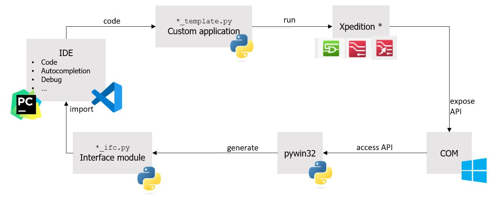

# ECAD functions and utilities toolbox

This toolbox contains commonly used functions and tools with regard to ECAD Tool automation, such as Siemens Xpedition Designer, Layout, Fablink, etc.

Directory structure:

* xpedition_designer - This library contains commonly used functions and tools with regard to Siemens Xpedition Designer Tool automation. 
* xpedition_layout - This library contains commonly used functions and tools with regard to Siemens Xpedition Layout Tool automation.
* xpedition_fablink - This library contains commonly used functions and tools with regard to Siemens Xpedition Fablink Tool automation.
* xpedition_variantmanager - This library contains commonly used functions and tools with regard to Siemens Xpedition Variant Management Tool automation.
* xpedition_constraintmanager - This library contains commonly used functions and tools with regard to Siemens Xpedition Constraints Management Tool automation. (not tested)

The following illustrates the data flow of the toolbox

## License

This project is open-source and available under the [MIT License](LICENSE).
"""
