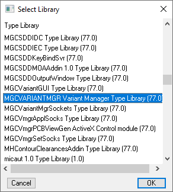
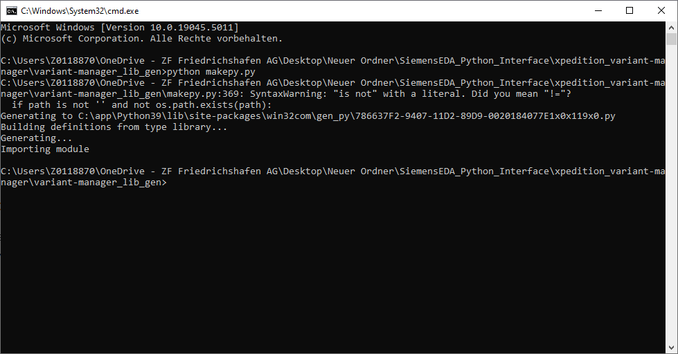
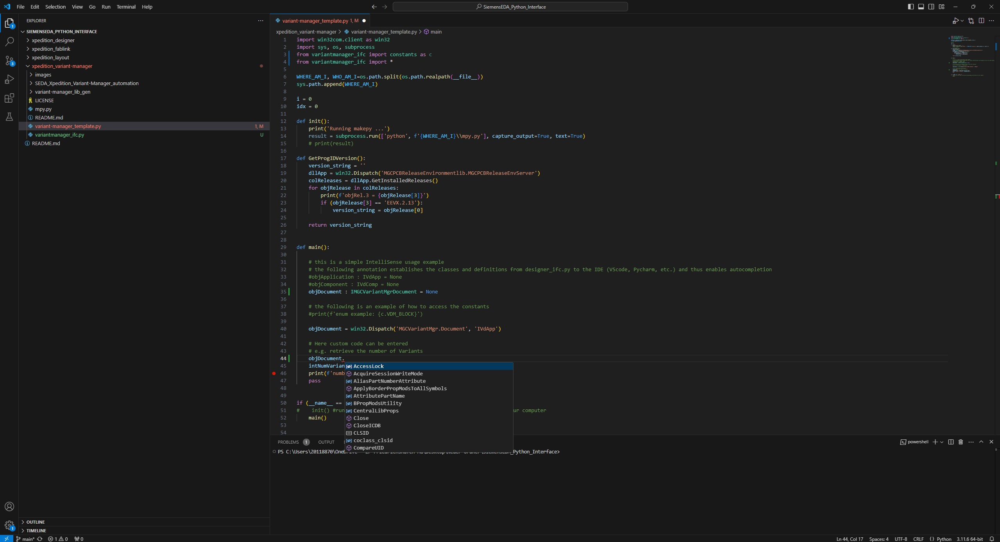

# ECAD functions and utilities library

This toolbox contains commonly used functions and tools with regard to ECAD Tool automation, here with Siemens Xpedition Variant Manager.
It also contains IntelliSense stub module generator which is used to assist development of Automation Scripts by means of code autocompletion.
More information about the generator can be found [here:](./variant-manager_lib_gen/README.md).

Directory structure:

* variant-manager_ifc - mockup module containing constants defined by Variant-Manager; module is iported as 'constants' and it can be used in Automation Scripts executed internally and externally 
* variant-manager_lib_gen - python script used to generate Variant-Manager stub for autocompletion; additional [info:](./variant-manager_lib_gen/README.md) 

## Usage

### 0. Prerequisites
```
# COM interface Python Module (start from installation Directory of the desired Python installation, e.g. C:\app\Python311)
python -m pip install pywin32
```
### 1. Generate COM interface classes
```
# Generate the Python file containing COM interface classes (already creating .py file for 'ViewDraw' (=Xpedition Desinger))
python mpy.py
```
This is the tool to be used for Variant-Manager (when makepy.py from within mp.py is passed with no arguments)



File containing library COM ifc classes will be generated:


### 2. Extending COM interface (optional: Need to be done when switching to newer Xpedition Variant-Manager Release)

Generated file can be used together with Visual Studio Code (VSCode) IDE to enable autocompletion function.
One can use ‘sniff’ tool to add COM-object properties into classes which were generated with, as those will not be available from 
original description file generated by makepy utility. Following script generates properties for ‘Variant-Manager’ tool.

```
# Generate the Python file containing COM interface classes
python sniff_variant-manager_ifc.py 
```
Copy the generated file into this folder [here:](./variant-manager_ifc.py).

Example for autocompletion:

Annotation in the code is required to get this to work. See variant-manager_template.py for annotation examples (objApplalication and objComp).

### 3. Use the variant-manager_template.py as starting point for your code
```
python variant-manager_template.py
```

## License

This project is open-source and available under the [MIT License](LICENSE).
"""


